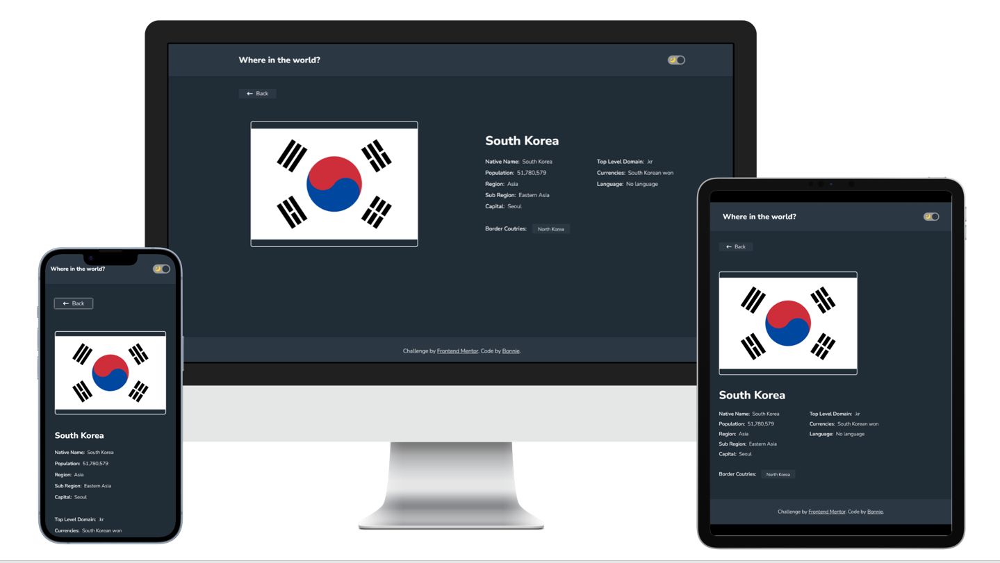
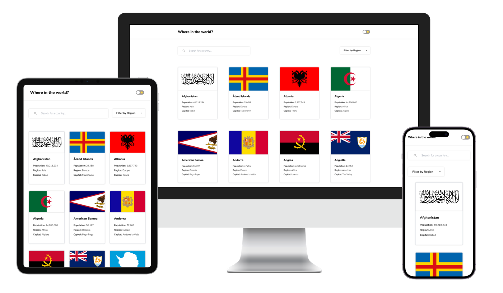

# Frontend Mentor - REST Countries API with color theme switcher solution

This is a solution to the [REST Countries API with color theme switcher challenge on Frontend Mentor](https://www.frontendmentor.io/challenges/rest-countries-api-with-color-theme-switcher-5cacc469fec04111f7b848ca). Frontend Mentor challenges help you improve your coding skills by building realistic projects. 

## Table of contents

- [Overview](#overview)
  - [The challenge](#the-challenge)
  - [Screenshot](#screenshot)
  - [Links](#links)
- [My process](#my-process)
  - [Built with](#built-with)
  - [What I learned](#what-i-learned)
  - [Continued development](#continued-development)
- [Contact](#Contact)

## Overview

### The challenge

Users should be able to:

- See all countries from the API on the homepage
- Search for a country using an `input` field
- Filter countries by region
- Click on a country to see more detailed information on a separate page
- Click through to the border countries on the detail page
- Toggle the color scheme between light and dark mode *(optional)*

### Screenshot




### Links

- [Solution URL](https://github.com/wanhsuan625/REST-Countries-API-with-color-theme-switcher-solution)
- [Live site URL](https://rest-countries-api-with-color-theme-switcher-solution-delta.vercel.app/)

## My process

### Built with

- Semantic HTML5 markup
- TaiwindCSS
- Flexbox / CSS Grid
- Mobile-first workflow
- [React](https://reactjs.org/) - JS library

### What I learned

- 1. 
In this project I try to use TailwindCSS to implement light/dark mode:
First, configure the darkMode parameter in the tailwind.config.js file. Then, I use the dark: prefix in any element which I want to apply specific styles for dark mode.

```
    module.exports = {
        darkMode: 'class',
        ...
    }
```

- 2. 
<React Route>
Using the ":countryName" parameter to link to different routes.

### Continued development

Creating a fun game for identifying countries and their flags.

## Contact

- :woman: 詹宛璇 Wan Hsuan, Chan
- :e-mail: Email: bna279@gmail.com
- Frontend Mentor - [Bonnie Chan](https://www.frontendmentor.io/profile/wanhsuan625?_blank)